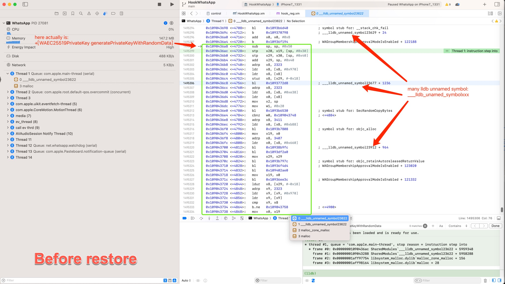
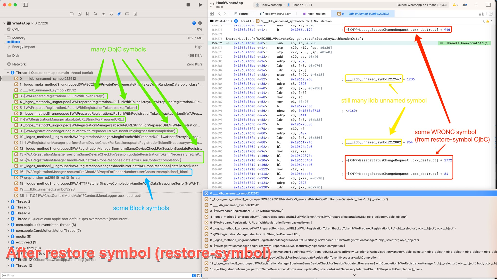
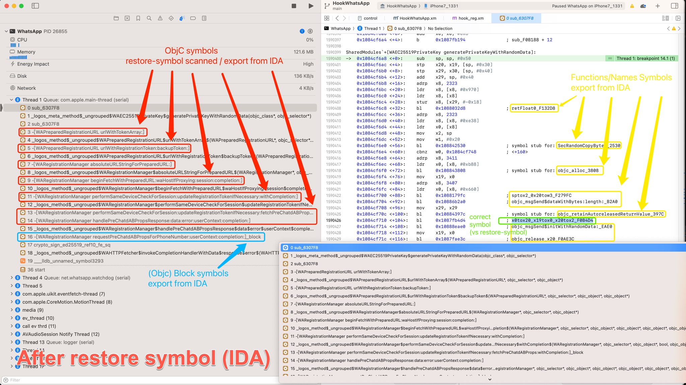
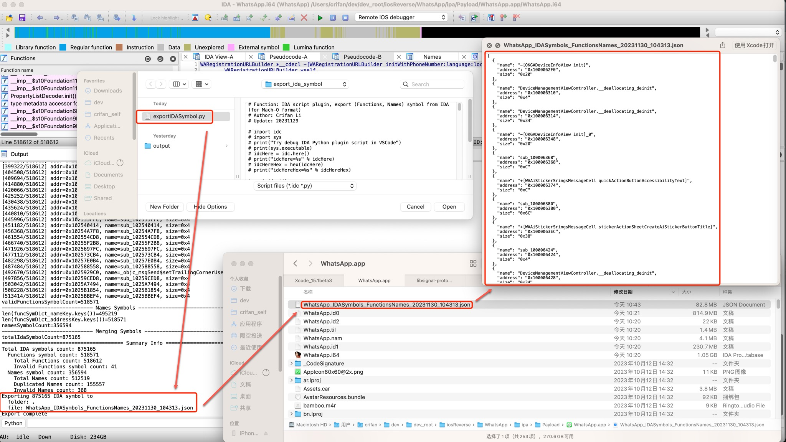
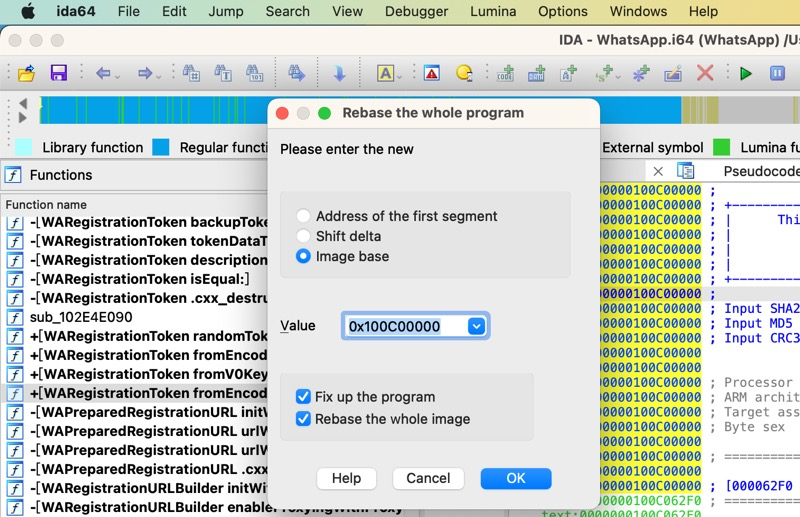
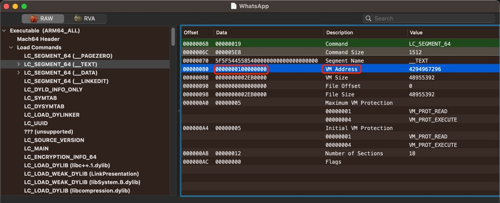
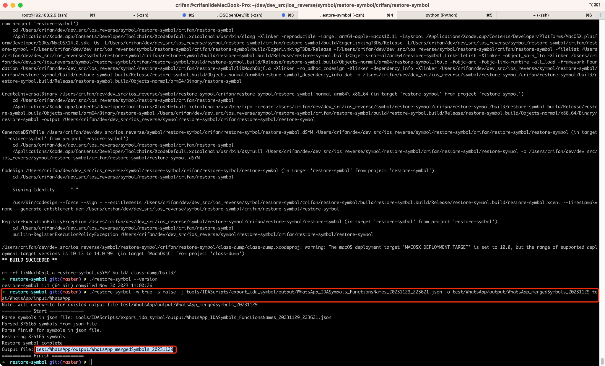
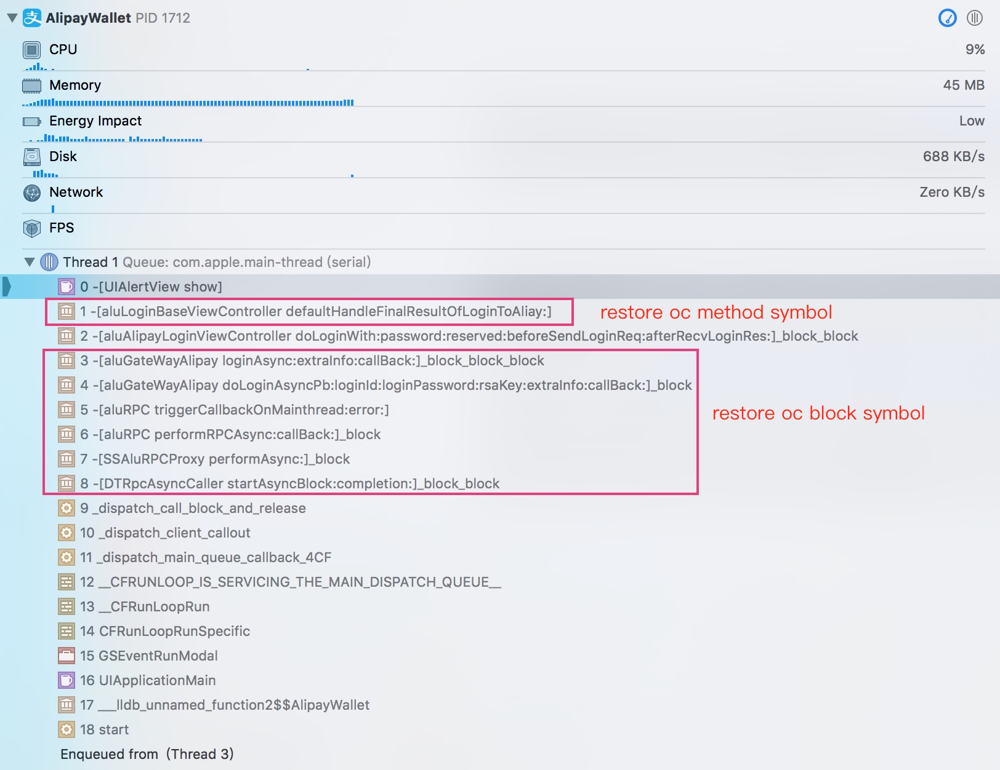

# restore-symbol

* Update: `20231201`

Forked from [HeiTanBc/restore-symbol](https://github.com/HeiTanBc/restore-symbol), do many furture optimization, to facilicate restore symbols for iOS Mach-O file

## Effect Compare

* Before restore symbol
  * 
* After restore symbol
  * for: `restore-symbol`=`rs`'s ObjC + block
    * 
  * for: `IDA`'s Functions + Names + block
    * 

## Prepare

### download code

```bash
git clone --recursive https://github.com/crifan/restore-symbol.git
```

### compile to generate `restore-symbol`

```bash
cd restore-symbol
make
```

then can:

* show version
  * `./restore-symbol --version`
* show help
  * `./restore-symbol --help` == `./restore-symbol`

## Usage

### Restore symbols

* Summary
  * for anyone: have `IDA Pro`
    * (1) `ida_search_block.py`: scan and writeback **block** symbols to IDA
    * (2) `exportIDASymbol.py`: export **IDA** (`Functions` (include ObjC) + `Names` + `block`) symbols to json file
    * (3) `restore-symbol`: **restore** all symbols for iOS Mach-O binary file
  * for anyone: no `IDA Pro`
    * `restore-symol` : restore (only) **ObjC** symbols
* Details:

#### (1) scan and writeback **block** symbols to IDA

* (1) scan and writeback **block** symbols to IDA
  * run `tools/IDAScripts/search_oc_block/ida_search_block.py` in IDA
    * default config: 
      * `enableWriteback = True`: write back (scanned objc block symbol name) into IDA
      * `isExportToFile = True`: meanwhile also export block symbol file (for furture use, or manual check)
  * Example
    * WhatsApp
      * 

#### (2) export **IDA** symbols (`Functions` + `Names`, and above **block** symbols) to json file

* (2) export **IDA** symbols (`Functions`(inside include ObjC symbols) + `Names`, and above **block** symbols) to json file
  * run `tools/IDAScripts/export_ida_symbol/exportIDASymbol.py` in IDA
    * default config
      * `isVerbose = False`: no verbose log
        * change to `isVerbose = True` if you want see details
      * `isExportToFile = True`: export final all symbols to json file
      * `enableDemangleName = True`: for (`Functions` + `Names`) all symbol names, use demangle name if not None
      * `outputFolder = None`: default output exported file to current folder of IDA opened Mach-O file
        * set to your expected other folder if necessary
  * Example
    * WhatsApp
      * 
  * Attention
    * makesure `IDA's image base` == `Mach-O vmaddr base` is same
      * Example
        * WhatsApp
          * before: IDA image base=`0x100C00000`
            * 
          * after `Rebase program`, IDA's image base=`0x100000000`
            * 
          * same with (MachOView see) WhatsApp's vmaddr=`0x100000000`
            * 

#### (3) **restore** all symbols for iOS Mach-O binary file

* (3) **restore** all symbols for iOS Mach-O binary file
  * run `./restore-symbol` to restore IDA exported all symbols (IDA's Functions+Names and block)
    ```bash
    restore-symbol -w true -s false -j {exported_IDA_symbols.json} -o {outputFile_RestoredSymbol} {inputMachOFile}
    ```
  * Example
    * WhatsApp
      ```bash
      ./restore-symbol -w true -s false -j tools/IDAScripts/export_ida_symbol/output/WhatsApp_IDASymbols_FunctionsNames_20231129_223621.json -o test/WhatsApp/output/WhatsApp_mergedSymbols_20231129 test/WhatsApp/input/WhatsApp
      ```
        * 

#### `restore-symol` (only) ObjC symbols

use `restore-symol` to restore **ObjC** symbols, passing argument with `-s true`=`--scan-objc-symbols true`

```bash
restore-symbol -s true -o {outputFile_RestoredSymbol} {inputMachOFile}
```

* Note
  * after `restore-symbol` restored ObjC symbol, there are some wrong symbol
    * how to fix: use above (`exportIDASymbol.py` expored) **IDA** symbols

### Auto repack IPA file

* use `tools/autoRepackIpa/autoRepackIpa.py`
  * to auto do all steps for your
    * (1) call `restore-symbol` to restore symbols
    * (2) call `codesign` to resign
    * (3) `unzip` original ipa
    * (4) `replace` to new resigned mach-o file
    * (5) `zip` folder to ipa file
  * Example
    * WhatsApp
      * 
  * Attention
    * before use it, you need to edit to chagne to **your** `mach-o file` and `related paths`

## Changelog

* 20231115
  * other updates for `exportIDASymbo.py`, `mergeSymbols.py`
* 20231103
  * add `tools/IDAScripts/export_ida_symbol/exportIDASymbol.py`
    * to export IDA symbols
  * add `tools/mergeSymbols/mergeSymbols.py`
    * to merge all symbols from restore-symbol restored, exported from IDA functions list, scanned from IDA block
* 20231027
  * `search_oc_block/ida_search_block.py`
    * Converted to support [IDA 7.4+](https://hex-rays.com/products/ida/support/ida74_idapython_no_bc695_porting_guide.shtml) (`SegName`->`get_segm_name`, `Qword`->`get_qword`, etc.)
    * Converted to Python 3.x(`print xxx`->`print(xxx)`, `filter`->`list` etc.)
    * Fixed bug: `RecursionError: maximum recursion depth exceeded while calling a Python object`

## restore-symbol help

```bash
➜  restore-symbol git:(master) ✗ ./restore-symbol --help

restore-symbol 2.0 (64 bit)

Usage: restore-symbol [-o <output-file>] [-j <json-symbol-file>] [-w <true/false>] [-s <true/false>] [-b <objcSymbolsOutputFile>] [-r <true/false>] [-p] <input-mach-O-file>

  where options are:
    -h,--help                                              Print this help info then exit
    -v,--version                                           Print version info then exit
    -o,--output <output-file>                              New mach-O file path
                                                             default: null
    -j,--json <json-symbol-file>                           Json file containing extra symbol info, the key is "name","address"
                                                             like this:
                                                               [
                                                                 {
                                                                   "name": "main",
                                                                   "address": "0xXXXXXX"
                                                                 },
                                                                 {
                                                                   "name": "-[XXXX XXXXX]",
                                                                   "address": "0xXXXXXX"
                                                                 },
                                                                 ...
                                                               ]
                                                             default: null
    -w,--overwrite-output-file <true/false>                Overwrite output file if existed
                                                             default: false
    -s,--scan-objc-symbols <true/false>                    Scan objc symbols or not
                                                             default: true
    -m,--remove-duplicated-objc-symbols <true/false>       Remove duplicated objc symbols or not after scan objc symbols
                                                             default: true
    -b,--objc-symbols-output-file <objcSymbolsOutputFile>  Export objc symbols to file
                                                             default: null
    -r,--restore-symols <true/false>                       Restore symbol or not
                                                             default: true
    -p,--replace-restrict                                  New mach-O file will replace the LC_SEGMENT(__RESTRICT,__restrict)
                                                             with LC_SEGMENT(__restrict,__restrict) to close dylib inject protection
                                                             default: disabled
```

## TODO

* [ ] add compiled `restore-symbol` to release
* [ ] update `class-dump` to support new load command: `0x80000033`, `0x80000034`

------

A reverse engineering tool to restore stripped symbol table for iOS app.

Example: restore symbol for Alipay



## How to use

### Just restore symbol of oc method

- 1. Download source code and compile.

```bash
git clone --recursive https://github.com/HeiTanBc/restore-symbol
cd restore-symbol && make
./restore-symbol
```

- 2. Restore symbol using this command. It will output a new mach-o file with symbol.

```bash
./restore-symbol /pathto/origin_mach_o_file -o /pathto/mach_o_with_symbol 
```

- 3. Copy the new mach-o file (with symbol) to app bundle, replace the origin mach-o file with new mach-o file. Resign app bundle.

```bash
codesign -f -s - --timestamp=none --generate-entitlement-der --entitlement ./xxxx.app.xcent ./xxxx.app
```

- 4. Install the app bundle to iOS device, and use lldb to debug the app. Maybe you can use the ```ios-deploy```, or other way you like. If you use ```ios-deploy``` , you can execute this command.

```bash
brew install ios-deploy
ios-deploy -d -b xxxx.app
```

- 5. Now you can use ```b -[class method]``` to set breakpoint.

### Restore symbol of oc block

- 1. Search block symbol in IDA to get json symbol file, using script([`search_oc_block/ida_search_block.py`](./search_oc_block/ida_search_block.py)) .


- 2. Use command line tool(restore-symbol) to inject oc method symbols and block symbols into mach o file.

```bash
./restore-symbol /pathto/origin_mach_o_file -o /pathto/mach_o_with_symbol -j /pathto/block_symbol.json
```

- 3. Other steps(resign, install, debug) are samen as above.

## Command Line Usage

```bash
# ./restore-symbol --help

restore-symbol 1.0 (64 bit)

Usage: restore-symbol -o <output-file> [-j <json-symbol-file>] <mach-o-file>

  where options are:
    -o,--output <output-file>                              New mach-o-file path
    -s,--scan-objc-symbols <true/false>                    true/false to enable/disable to disable scan objc symbols
    -e,--export-objc-symbol <output-objc-symbol-file>      Export ObjC symbol file while restore ObjC symbol
    --replace-restrict                                     New mach-o-file will replace the LC_SEGMENT(__RESTRICT,__restrict)
                                                           with LC_SEGMENT(__restrict,__restrict) to close dylib inject protection
    -j,--json <json-symbol-file>                           Json file containing extra symbol info, the key is "name","address"
                                   like this:
                               
                                    [
                                         {
                                          "name": "main", 
                                          "address": "0xXXXXXX"
                                         }, 
                                         {
                                          "name": "-[XXXX XXXXX]", 
                                          "address": "0xXXXXXX"
                                         },
                                         .... 
                                        ]
    -h,--help                      Print this help info then exit
```
